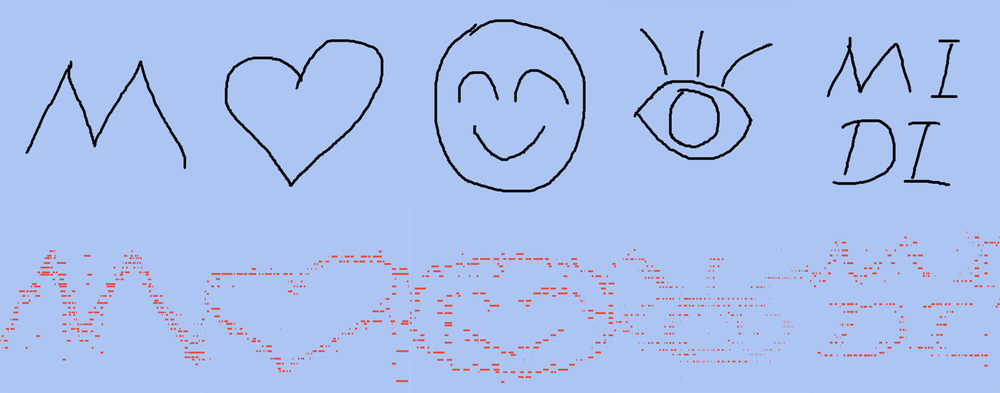
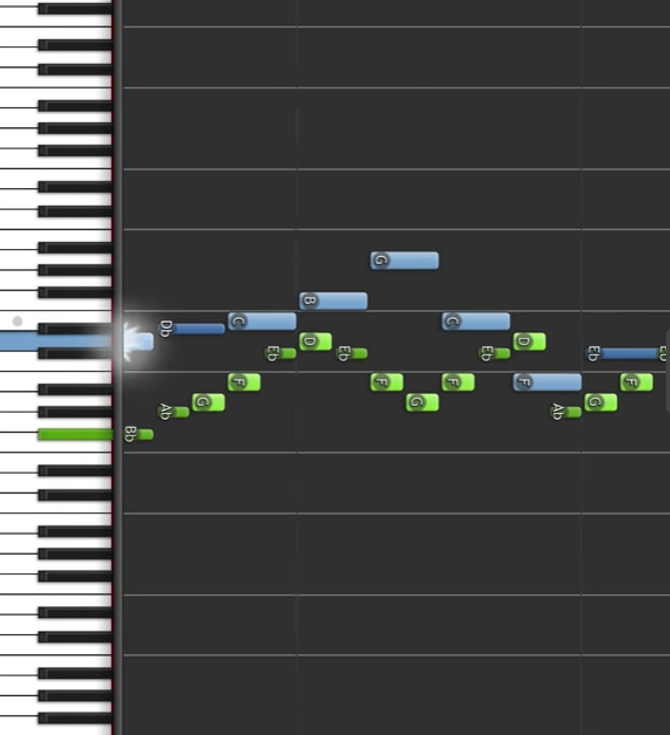
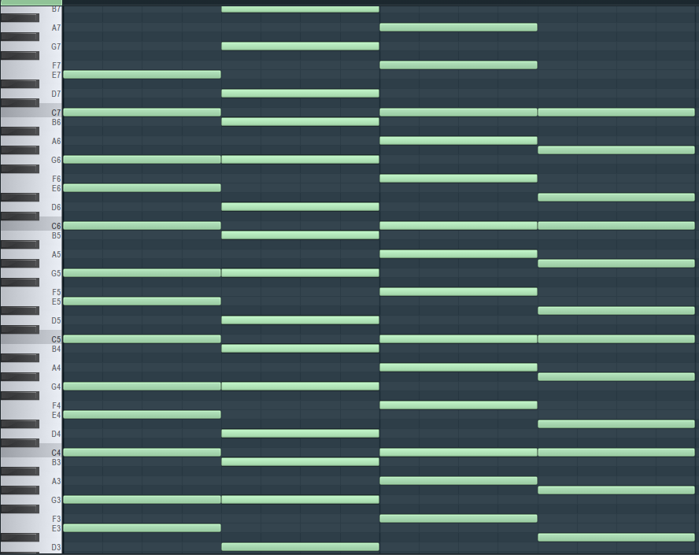
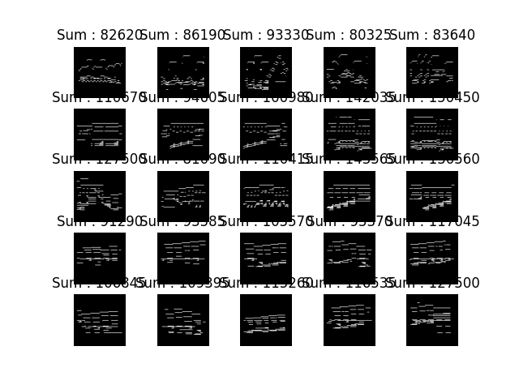
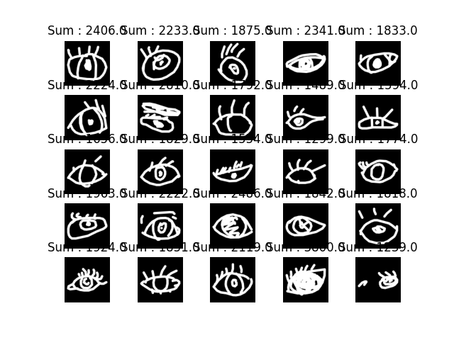
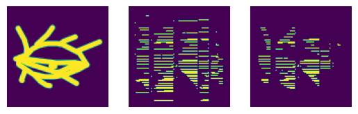

# midiDraw

## Overview
This project aims to generate a piece of music in midi format, which visually matches a given image. However, during our trial, many plausible methods failed to achieve the desired results. We here list the steps we have taken, the problems we encountered, and the solutions we tried.

## Final result

The above images is the input drawing, and the below is the generated music in midi format. 

## About midi format

A piece of piano music in midi format is represented as a sequence of notes, each with a start time, end time, pitch, and velocity. The pitch is an integer representing the note's position on the piano keyboard, e.g., 60 corresponds to middle C. The velocity indicates how hard the note is played, affecting its loudness.

If we visualize the midi music as an image, each note can be represented as a vertical line, where the height corresponds to the pitch and the width corresponds to the duration of the note. The color or brightness of the line can represent the velocity of the note. This is what we mean by "midi as image".



## Why valid task

灵感来源：[https://www.bilibili.com/video/BV1mr4y1C7Fq](https://www.bilibili.com/video/BV1mr4y1C7Fq)

For music, usually a certain period is dominated by a chord, which is a combination of several notes played together. The chord may contain multiple notes, while playing any combination of these notes will still sound harmonious. This means that the music can have multiple valid representations, and the same chord can be represented by different notes.



As the figure above shows, all valid notes in a piece of music can actually forms a dense gird, which is dense enough to be represented as an image with visual semantic. 

## Method

This is done by combining the hard-coded methods and a large pretrained model called [GiantMusicTransformer](https://github.com/asigalov61/Giant-Music-Transformer). During generation, we maintained tow pairs of pointers to track the current position in the image and generated midi tokens. The image is traversed pixel by pixel, and once a new logits is generated by the model, we may add weights to the neighboring pixels of the corresponding logits, then do sampling to get the next midi token. The process is repeated until the end of the image is reached.

## Evaluation

We use [Frechet Audio Distance](https://arxiv.org/abs/1812.08466) to evaluate the performance of our midi generator. To be precise, Frechet Audio Distance (**FAD**) using a pretrained audio classification model (we use VGGish), embeddings are extracted from both the output of a enhancement model that we wish to evaluate and a large database of background music, and after extracting the two groups of embeddings, the Frechet distance is then computed between
multivariate Gaussians estimated on these embeddings.

Results:
| Comparison Pair       | Frechet Audio Distance Value (smaller means closer) | Note    |
|-----------------------|--------------------|------------------------------------------|
| `waves_gt` & `gen_wav`  | 0.6595358140049611805 |                                          |
| `waves_gt` & `waves_img` | 16.713074818676360769 |                                          |
| `waves_gt1` & `waves_gt2` | 0.07102940486668583159 | `1` or `2` suffix indicates the first and second half of the dataset     |
| `waves_gt1` & `waves_img1` | 16.620743359589181008 | `1` suffix indicates the first half of the dataset  |
| `waves_img` & `gen_wav`  | 14.831610573498671924 |                      |
| `waves_gt10` & `gen_wav` | 0.6587375545042890605 | `10` suffix indicates both were clipped to 10 seconds |
| `waves_gt10` & `waves_img` | 16.732251241549333493 | `10` suffix indicates both were clipped to 10 seconds |

Here, `waves_gt` represents the music from the dataset, `gen_wav` is the music generated using our method, and `waves_img` is music obtained by naively converting images directly to MIDI.

From the results above, it's evident that `waves_gt` and `gen_wav` are very close (approximately `0.66`). This is about 1.5 orders of magnitude smaller than the proximity of `waves_gt` vs `waves_img` (`16.7`). On the other hand, the comparison of `waves_gt1` vs `waves_gt2` yields only `0.07`, which is reasonable. This suggests that the measurement error of this distance metric is roughly `0.07`. Since `0.66` is significantly larger than `0.07`, it indicates the results are highly credible.


# How to play

## Installation
To run this project, you need to install the following dependencies:
```bash
sudo apt install fluidsynth
conda create --name midiDraw --file requirements.txt
conda activate midiDraw
```

## To run generation
See [my_autoregressive_gen.ipynb](./GiantMusicTransformer/my_autoregressive_gen.ipynb) for the generation process. The code is written in Python 3.8.

## Frontend
For one bash, run
```
cd GiantMusicTransformer/
python -m http.server
```
for another bash, run
```
cd GiantMusicTransformer/
python sample.py
```


# Previous Trials that failings

## Dataset
- [Done] Check what midi is like, design how it should be changed to img. See [json_midi_example](./dataset/midi_dataset/midi_exmple.json) and .
- [Done] Midi dataset: [https://github.com/bytedance/GiantMIDI-Piano](GiantMIDI-Piano), [https://magenta.tensorflow.org/datasets/maestro](MAESTRO), [https://github.com/asigalov61/Tegridy-MIDI-Dataset?tab=readme-ov-file](TBD)
- [Done] Img dataset, try QuickDraw or just MNIST. See .
- [Done] Write a `midi2img.py` to convert midi to img, and `img2midi.py` to convert img to midi. [**Note: facing sever pace loss, and has no gradient.**]

- [TODO] Find a better dataset instead of Classical music! 古典不好听！我要游戏音乐！or anything else


## LOSS 
- For img, should tolerant scale and shift. Also need Gaussian on midi-generated imgs to fillin strokes. We can train another network on augmented data to do this.
- [**FAILED**] For midi, should tolerant chords and some midi shift, also can train another network on augmented data to do this. But better use a pretrained model to do this. **failed since no good data augmentation methods or a pretrained musical-comparing model is found. The key failing in this project.**


## Music Generation Model
- [**Failed, still no idea**] Diffusion. No idea but promising.
- [**Failed, failed to realize a multi-track or pic-based vae music generator**] VAE. img+midi -> z -> midi. Compute loss.
- [**Not tried yet**] GAN. noise -> midi. D1: is midi a music? D2: is midi an img? Most simple to implement!
- [**Failed, failed for images generation**] RNN. Every column as a token. make some sense. 

Thoughts: 人应该是，每一列单独，根据和弦转化成最近的东西。加音或者减音，都是和弦内音。

hardcode怎么写？最小单位，1~n, 把和弦内的音保留下来，其它的丢掉。试一试吧。
或者，先用和弦内音铺满，再丢掉一些

我草，这个绝对是有用的。有数据集了！

以及，旋律可以小噪点。

那么音乐数据集不太行，最好是游戏音乐之类的，并且拍子能卡下来。

- [Done] TODO 1 写出一个hardcode再说
- [**Failed, failed to construct a good data agmentation.**] TODO 2 对比学习，改 loss。额外训练一个模型，给两段音乐，判断相似度。思路不一定对。


## Another idea: 
[**Failed 大多音乐的像素点太稀疏了，即使人工也没法对应画出有意义的图片**]
音乐生成不好搞的话，重点做图片生成，用图片匹配midi
1. 最后取midi被图片mask以后剩下的东西
2. 训练图片生成器，加一个loss，在音乐里面采样，能和音乐匹配
3. loss 长得比较像 $\alpha_1*(img - maskedMidi) + \alpha_2(midi - maskedImg) + originalLoss$

灵感来源于图片：
